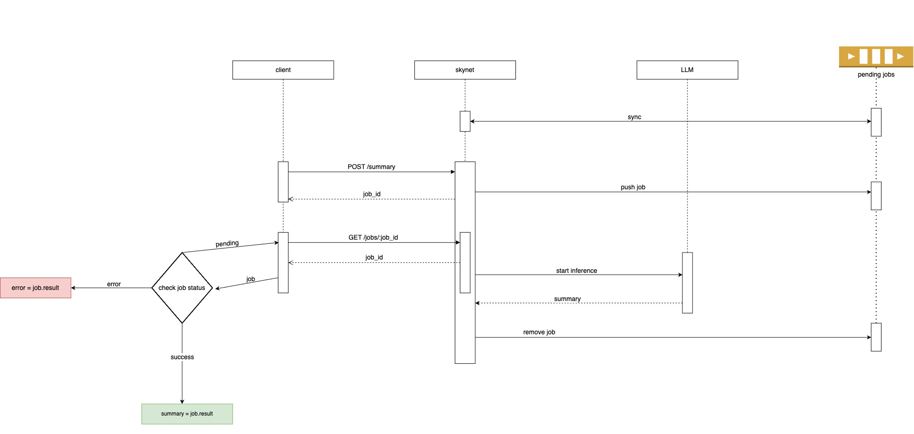

# Skynet Summaries Module

Extracts summaries and action items from a given text. The service can be deployed to use either vllm or Ollama. It is split into two sub-modules: `summaries:dispatcher` and `summaries:executor`.

`summaries:dispatcher` will do CRUD for jobs with a Redis installation, while `summaries:executor` performs the actual inference. They can both be enabled at the same time or deployed separately.

> All requests to this service will require a standard HTTP Authorization header with a Bearer JWT. Check the [**Authorization page**](auth.md) for detailed information on how to generate JWTs or disable authorization.

## Requirements

- Redis
- Poetry

## Flowchart



## Configuration

All of the configuration is done via env vars. Check the [Skynet Environment Variables](env_vars.md) page for a list of values.

## Running with Ollama

First make sure Ollama is installed and running.

```bash
# Download the preferred llama model
ollama pull llama3.1

export LLAMA_PATH="llama3.1"
# disable authorization (for testing)
export BYPASS_AUTHORIZATION=1

# start Redis
docker run -d --rm -p 6379:6379 redis 

poetry install
./run.sh
```

Visit http://127.0.0.1:8000

## Build Image

```bash
docker buildx build --push --progress plain --platform linux/amd64 -t your-registry/skynet:your-tag .
```

When running the resulting image, make sure to mount a model under `/models` on the container fs.

### Code samples

JavaScript: https://github.com/jitsi/skynet/blob/master/docs/sample.js
